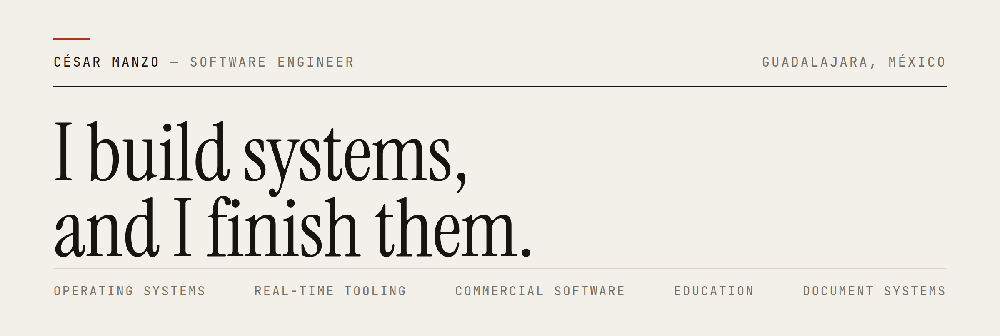
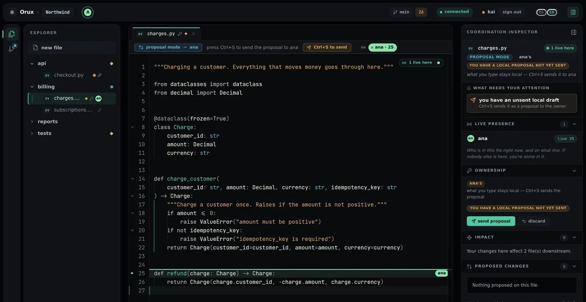

<picture>
  <source media="(prefers-color-scheme: dark)" srcset="assets/header-dark.png">
  
</picture>

An operating system in Rust that boots on real hardware. A coordination layer on top of an actual Git repository. The catalogue and price engine a hardware store works its counter from. Six systems, five domains, and no stack in common — but the same way of getting there, and the evidence that each one runs.

**[Portfolio →](https://cesarmanzo-portafolio.vercel.app/)** · [cesarmanzocode@gmail.com](mailto:cesarmanzocode@gmail.com) · [LinkedIn](https://www.linkedin.com/in/c%C3%A9sar-alberto-manzo-olivares-b503383b8/)

Open to new work — remote or in Guadalajara. · **ES** — Ingeniero de software en Guadalajara: sistemas completos, terminados y con la evidencia de que corren. El portafolio está también en español.

## Selected work

Every capture below comes from the project itself — real runs, not mock-ups.

### 01 · Thalyx

`OPERATING SYSTEM · RUST` — in development; Phase 1 closed on real hardware

On every mainstream OS an agent is a guest — to do anything it has to pretend to be a human. Thalyx inverts that: the automation is a first-class citizen, and the one component that is never trusted. It executes nothing, and the frame above is drawn by the core from the module's *signed* manifest. A grant then leaves userspace to become a bit in a BPF map, and what was not granted is refused inside the kernel. The human route stays complete — no shell, and nothing you can only do by asking.

> **Evidence.** A PC booted Thalyx from USB through its own firmware, drove HDMI and a real xHCI keyboard, installed itself onto a second disk and booted again without the medium. `verify.sh` on that machine: 143 proven, 2 not proven, 1 failed. Over 1,100 tests, including fault injection that kills the real binary between the directory rename and the symlink swap — nothing ends up half-installed. What is still unproven is published next to what is.

[Repository](https://github.com/CesarManzoCode/thalyx) · [What is proven, and what is not](https://github.com/CesarManzoCode/thalyx/blob/main/docs/STATUS.md)

### 02 · Orux

`REAL-TIME COLLABORATION · PYTHON · TYPESCRIPT` — reached production, then shut down

Git understands files and commits; teams work with responsibilities and dependencies. Orux is the layer in between. Ownership decides what an edit *means*, not whether you may make it: type into a file that is yours and it applies live; type into someone else's and the editor goes into proposal mode — you keep typing, the change stays local, and `Ctrl+S` sends it to the owner as a diff. That same save runs a semantic impact analysis and warns the people it affects — not *this file was touched* but *this function you depend on changed shape*, across four languages, at the deepest tier available per file.

> **Where it stands.** Orux reached production at `orux.space` and was shut down; the service is gone. The repository is the finished product, kept as an engineering record, and everything still runs locally — that capture came from a local run. Each workspace is a real Git repo on disk, so `git clone` walks away with everything. No conflict resolution, deliberately: the thesis is to prevent the collision, not to merge it afterwards.

[Repository](https://github.com/CesarManzoCode/orux)

### 03 · Ferrol

`CATALOGUE AND PRICES · TYPESCRIPT` — private repository; stages 0–8 complete

Software written against a business, not a spec. Ferreterías Ferrol, in Guadalajara, sells more than twelve thousand articles that nobody — customer or counter staff — had a way to search. 12,851 of them were imported end to end from the files the shop actually keeps. Prices derive from cost with per-list rules, money is exact by contract, and private prices are isolated from the public cache so one customer's rates can never surface on someone else's page. No checkout, on purpose: the request leaves through WhatsApp with a folio already registered, because that is how the shop already sells.

> **Evidence.** With JavaScript disabled, searching, filtering by URL and opening an article all still work. Nothing overflows horizontally at 390, 768 or 1440 px, the console is clean, and a full page load measured between 111 and 400 ms against the production build. The one criterion still open is external — domain and VPS.

[Ferrol on the portfolio →](https://cesarmanzo-portafolio.vercel.app/#ferrol)

## Also built

**04 · [ACREDITA-BACH](https://github.com/CesarManzoCode/study-acreditabach)** — `STUDY PLATFORM · JAVASCRIPT` 
The syllabus of the Ceneval exam that accredits high school in México, turned into a daily plan. It teaches before it asks: new material is explained first, the question comes after. 1,032 cards and 1,708 items written against the official topic guidance, and mocks with the exam's real shape — 106 items in four and a half hours, then 99 in four.

**05 · [Studymation](https://github.com/CesarManzoCode/Studymation)** — `DOCUMENT PLATFORM · PYTHON · NEXT.JS` 
A student describes an assignment; a `.docx` comes back in the institution's own format. A pipeline rather than a prompt: explicit steps, each with its own contract and failure mode. Sources are verified in Semantic Scholar, Crossref and Brave, and when nothing useful turns up the step reports `found = false` rather than inventing a reference.

**06 · [C++ CETI](https://github.com/CesarManzoCode/cpp-ceti)** — `TEACHING PLATFORM · TYPESCRIPT` — [open the platform →](https://cpp-ceti.vercel.app) 
At the CETI in Guadalajara, C++ is taught by copying code onto a blackboard. Ten units where you read something short, write the code yourself, and have it really compiled and run against test cases. The feedback never just says *incorrect*: it puts the expected output beside yours and points at the line and column where they part.

## The same loop, six times

Fix the constraints, build against them, then find out what the machine actually does. That order is the only thing an operating system and a hardware store's catalogue have in common — the stack changes with the problem, the loop is what carries over.

`01 FRAME` → `02 BUILD` → `03 INSPECT` → `04 TEST` → `05 RUN` → `06 CORRECT` → `01 …`

Tooling is whatever raises the rate at which a decision becomes working software: type systems, static analysis, test harnesses, CI, coding agents and language models. That list changes every year; what I ask of it does not. What settles whether the result is *correct* is somewhere else — the compiler, the test, the invariant Postgres refuses to break, a board that either boots or does not. None of it negotiates, and that is where a system has to get before I call it finished.

---

**[Portfolio](https://cesarmanzo-portafolio.vercel.app/)** · **[cesarmanzocode@gmail.com](mailto:cesarmanzocode@gmail.com)** · **[LinkedIn](https://www.linkedin.com/in/c%C3%A9sar-alberto-manzo-olivares-b503383b8/)**

César Alberto Manzo Olivares · Guadalajara, Jalisco, México · available remotely.
